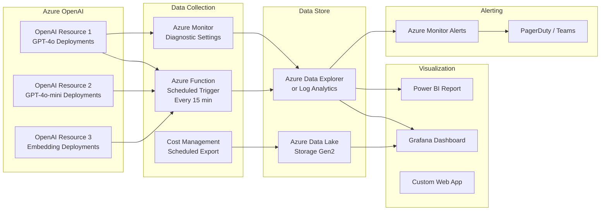

# Azure OpenAI Billing & Cost Management — Enterprise Guide

> A comprehensive reference for understanding, monitoring, and optimizing Azure OpenAI costs. Designed for architects, FinOps teams, AI platform engineers, and technical stakeholders.

---

## 1. Executive Summary

Azure OpenAI billing is based on **token consumption** and/or **provisioned capacity (PTU)**. Understanding how billing works at the model level is critical for enterprise customers who need cost predictability, governance, and optimization.

### Key Concepts at a Glance

| Concept | Description |
|---------|-------------|
| **Token** | The fundamental billing unit. Both input (prompt) and output (completion) tokens are counted and billed. |
| **PTU (Provisioned Throughput Unit)** | Reserved capacity billed hourly regardless of usage. Provides guaranteed throughput and predictable latency. |
| **PAYG (Pay-As-You-Go)** | Consumption-based billing. You pay per 1,000 tokens processed. No commitment required. |
| **Model-Level Billing** | Different models have different per-token prices. GPT-4o costs more than GPT-4o-mini per token. |
| **Deployment** | Each model deployment has its own capacity allocation and usage tracking. |

### Why This Matters for Enterprise Customers
- **Cost predictability**: AI workloads can generate unexpected costs without proper monitoring
- **Governance**: Regulated industries (FSI, healthcare) require clear cost attribution and audit trails
- **Optimization**: The difference between PTU and PAYG can represent 30-60% cost savings at scale
- **Accountability**: Teams need per-model, per-deployment cost visibility for chargeback/showback

---

## 2. Core Billing Concepts

### 2.1 Tokens — The Fundamental Unit

Every API call to Azure OpenAI processes **tokens** — fragments of text (roughly 4 characters or 0.75 words in English).

**How tokens are counted:**
- **Input tokens (prompt)**: The text you send to the model (system message + user message + context)
- **Output tokens (completion)**: The text the model generates in response
- **Both are billed separately**, and output tokens are typically more expensive than input tokens

**Example:**
| Component | Text | Approx. Tokens |
|-----------|------|----------------|
| System prompt | "You are a helpful financial advisor..." | ~15 tokens |
| User message | "What are the tax implications of..." | ~20 tokens |
| Context/RAG | Retrieved document chunks | ~500 tokens |
| **Total Input** | | **~535 tokens** |
| Model response | Detailed answer | ~300 tokens |
| **Total Output** | | **~300 tokens** |
| **Total Billed** | | **~835 tokens** |

### 2.2 Model-Level Pricing

Different models have significantly different costs per token:

| Model | Input (per 1M tokens) | Output (per 1M tokens) | Best For |
|-------|----------------------|----------------------|----------|
| GPT-4o | $2.50 | $10.00 | Complex reasoning, analysis |
| GPT-4o-mini | $0.15 | $0.60 | Simple tasks, classification, routing |
| GPT-4.1 | $2.00 | $8.00 | Coding, instruction following |
| GPT-4.1-mini | $0.40 | $1.60 | Balanced performance/cost |
| GPT-4.1-nano | $0.10 | $0.40 | High-volume simple tasks |
| o3 | $10.00 | $40.00 | Advanced reasoning, multi-step |
| o4-mini | $1.10 | $4.40 | Efficient reasoning |
| text-embedding-3-small | $0.02 | N/A | Embeddings for search |
| text-embedding-3-large | $0.13 | N/A | High-quality embeddings |

> **Note**: Prices are approximate and may vary. Always check [Azure OpenAI Pricing](https://azure.microsoft.com/pricing/details/cognitive-services/openai-service/) for current rates.

### 2.3 PTU vs PAYG — Detailed Comparison

| Dimension | PTU (Provisioned Throughput) | PAYG (Pay-As-You-Go) |
|-----------|------------------------------|----------------------|
| **Billing Model** | Hourly rate per PTU reserved | Per 1,000 tokens consumed |
| **Cost Predictability** | ✅ Fixed monthly cost | ❌ Variable, usage-dependent |
| **Latency** | ✅ Guaranteed low latency | ⚠️ Variable, may spike under load |
| **Throughput** | ✅ Guaranteed TPM | ⚠️ Subject to rate limits |
| **Commitment** | Monthly or annual reservation | No commitment |
| **Idle Cost** | ❌ Pays even when idle | ✅ No cost when idle |
| **Best For** | Production workloads with consistent, predictable traffic | Development, testing, variable/bursty workloads |
| **Cost at Scale** | 30-60% cheaper than PAYG at high utilization | More expensive at sustained high usage |
| **Scaling** | Manual (request PTU changes) | Automatic (up to quota limits) |

### 2.4 When to Use Each

**Use PTU when:**
- Workload has consistent, predictable demand (>60% utilization)
- Low latency is critical (real-time customer-facing applications)
- Cost predictability is required for budgeting
- Processing >1M tokens/day on a single model

**Use PAYG when:**
- Workload is bursty or unpredictable
- Still in development/testing phase
- Traffic is low (<100K tokens/day)
- Multiple models are used with varying demand
- Need flexibility to scale up/down quickly

**Hybrid approach (recommended for enterprise):**
- PTU for baseline production workload (the predictable 60-80%)
- PAYG for overflow/burst traffic
- Route via Azure API Management to prioritize PTU usage

---

## 3. What Customers Typically Ask (FAQ)

### "Can I see cost per model on my invoice?"
**Yes, partially.** Azure Cost Management shows costs at the **resource level** (per Azure OpenAI resource). If you deploy different models to different resources, you get model-level billing visibility. If multiple models share one resource, you'll see aggregated costs.

**Recommendation:** Deploy each model (or model family) to a separate Azure OpenAI resource for clean billing segmentation.

### "How do I track token usage per model?"
Token usage is available through:
1. **Azure Portal** → Your OpenAI resource → Metrics → "Processed Inference Tokens" (filterable by deployment)
2. **Usage API headers** → Every API response includes `usage.prompt_tokens` and `usage.completion_tokens`
3. **Azure Monitor / Log Analytics** → If diagnostic logging is enabled
4. **Azure Cost Management APIs** → Aggregated consumption data

### "Where do I see this in Azure Portal?"
- **Cost Management + Billing** → Cost Analysis → Filter by resource type "Microsoft.CognitiveServices"
- **Azure OpenAI Resource** → Metrics blade → Select "Processed Inference Tokens" metric
- **Azure OpenAI Resource** → Deployments → Each deployment shows capacity and usage

### "How do PTUs affect my billing?"
PTUs are billed **hourly** at a fixed rate regardless of usage. If you reserve 100 PTUs but only use 30%, you still pay for 100 PTUs.

**Key insight:** PTU billing appears as a separate line item from PAYG consumption. If you have both PTU and PAYG deployments, you'll see both charges on your invoice.

### "Why does my AI bill fluctuate month to month?"
Common causes:
1. **PAYG usage variance** — More API calls = higher costs
2. **Model changes** — Switching from GPT-4o-mini to GPT-4o increases per-token cost ~17x
3. **Prompt engineering changes** — Longer prompts = more input tokens
4. **Context window growth** — RAG applications adding more context documents
5. **New deployments** — Teams spinning up new models without cost awareness
6. **PTU scaling events** — Adding/removing provisioned capacity mid-month

---

## 4. Where Billing Data Lives in Azure

### 4.1 Azure Portal — Cost Management + Billing

**What you can see:**
- Total cost by resource, resource group, subscription
- Daily/weekly/monthly cost trends
- Cost by meter (token type, PTU hours)
- Budget alerts and forecasts

**How to access:**
1. Azure Portal → Cost Management + Billing → Cost Analysis
2. Filter: Resource type = `microsoft.cognitiveservices/accounts`
3. Group by: Resource, Meter, Tag

**Limitations:**
- ❌ No per-deployment cost breakdown (only per-resource)
- ❌ No real-time data (24-48 hour delay)
- ❌ Limited token-level granularity
- ❌ Cannot correlate cost with specific API calls

### 4.2 Azure OpenAI Resource — Metrics Blade

**What you can see:**
- Processed Inference Tokens (input + output, per deployment)
- HTTP request counts
- Latency metrics (P50, P95, P99)
- Rate limiting events (429 errors)
- Active tokens (for streaming)

**How to access:**
1. Azure Portal → Your OpenAI resource → Monitoring → Metrics
2. Select metric: "Processed Inference Tokens"
3. Split by: Deployment Name, Model Name

**This is the best place for token-level usage visibility per model.**

### 4.3 Required Access (RBAC)

| Role | What They Can See |
|------|------------------|
| **Billing Reader** | Cost data across subscriptions |
| **Cost Management Reader** | Cost analysis, budgets, exports |
| **Cognitive Services User** | Usage metrics for specific resources |
| **Monitoring Reader** | Metrics and diagnostic logs |
| **Owner/Contributor** | Everything above + management |

**Recommendation:** Grant `Cost Management Reader` to FinOps teams and `Monitoring Reader` to platform engineering.

---

## 5. Programmatic Access (APIs)

### 5.1 Azure Cost Management API

Retrieve cost data programmatically for dashboards and automation:

```
POST https://management.azure.com/subscriptions/{subscriptionId}/providers/Microsoft.CostManagement/query?api-version=2023-11-01

{
  "type": "ActualCost",
  "timeframe": "MonthToDate",
  "dataset": {
    "granularity": "Daily",
    "aggregation": {
      "totalCost": { "name": "Cost", "function": "Sum" }
    },
    "filter": {
      "dimensions": {
        "name": "ResourceType",
        "operator": "In",
        "values": ["microsoft.cognitiveservices/accounts"]
      }
    },
    "grouping": [
      { "type": "Dimension", "name": "ResourceId" },
      { "type": "Dimension", "name": "MeterCategory" }
    ]
  }
}
```

### 5.2 Azure Monitor Metrics API

Retrieve token usage per deployment:

```
GET https://management.azure.com/subscriptions/{subscriptionId}/resourceGroups/{rgName}/providers/Microsoft.CognitiveServices/accounts/{accountName}/providers/Microsoft.Insights/metrics?api-version=2024-02-01&metricnames=ProcessedInferenceTokens&timespan=2026-04-01T00:00:00Z/2026-04-29T00:00:00Z&interval=P1D&aggregation=Total&$filter=Deployment eq 'gpt4o-prod'
```

This returns daily token counts per deployment — the most granular billing-adjacent data available.

### 5.3 Usage Details API (for invoice-level data)

```
GET https://management.azure.com/subscriptions/{subscriptionId}/providers/Microsoft.Consumption/usageDetails?api-version=2023-11-01&$filter=properties/resourceType eq 'microsoft.cognitiveservices/accounts'&$top=1000
```

Returns line-item usage records with cost, quantity, meter details.

### 5.4 Data Pipeline Pattern

```
Azure Cost Management API ──→ Azure Function (scheduled) ──→ Azure Data Explorer / ADLS
Azure Monitor Metrics API ──→ Azure Function (scheduled) ──→ Azure Data Explorer / ADLS
                                                                        │
                                                               Grafana / Power BI
```

---

## 6. Observability & Dashboard Architecture

### 6.1 Why Custom Dashboards Are Necessary

Azure's native billing views have limitations:
- 24-48 hour data delay
- No per-deployment cost breakdown
- Cannot correlate usage with business metrics
- Limited alerting capabilities
- No multi-resource aggregation view

**Enterprise customers need custom dashboards** for real-time visibility, cost attribution, and proactive optimization.

### 6.2 Reference Architecture



### 6.3 Key Dashboard Panels

A well-designed AI billing dashboard should include:

| Panel | Data Source | Refresh Rate |
|-------|-----------|-------------|
| **Total Spend (MTD)** | Cost Management API | Daily |
| **Cost by Model** | Cost Management (grouped by resource) | Daily |
| **Token Usage by Deployment** | Azure Monitor Metrics | 15 min |
| **PTU Utilization %** | Azure Monitor Metrics | 5 min |
| **PAYG Token Burn Rate** | Azure Monitor Metrics | 15 min |
| **Cost Forecast (EOM)** | Cost Management API | Daily |
| **Rate Limiting Events** | Azure Monitor (429 count) | 5 min |
| **Latency by Deployment** | Azure Monitor (P95 latency) | 5 min |
| **Top Consumers (by app/team)** | Custom tagging + Cost API | Daily |
| **PTU vs PAYG Cost Comparison** | Calculated | Daily |

### 6.4 Grafana Integration

Grafana supports Azure Monitor as a native data source:

1. **Install Azure Monitor plugin** in Grafana
2. **Configure data source** with Service Principal credentials (Reader role)
3. **Create dashboards** using:
   - Azure Monitor Metrics → Token usage, latency, 429s
   - Azure Resource Graph → Resource inventory
   - Azure Cost Management (via API + JSON data source) → Cost data

**Key Grafana queries for Azure OpenAI:**
- `ProcessedInferenceTokens` — split by deployment, model
- `AzureOpenAIRequests` — request count and rate
- `AzureOpenAITokenTransaction` — token consumption details
- `ProvisionedManagedUtilizationV2` — PTU utilization percentage

---

## 7. Cost Optimization Strategies

### 7.1 Prioritize PTU Usage Over PAYG

If you have PTU capacity, always route traffic there first:

```
Request → APIM Gateway → Check PTU capacity
                            ├── Available → Route to PTU deployment ✅
                            └── Full → Overflow to PAYG deployment 💰
```

**Savings:** PTU at 70%+ utilization is typically 40-60% cheaper than equivalent PAYG usage.

### 7.2 Right-Size Your Models

Not every request needs GPT-4o:

| Task | Recommended Model | Cost vs GPT-4o |
|------|------------------|----------------|
| Simple classification | GPT-4o-mini | 94% cheaper |
| Code generation | GPT-4.1 | 20% cheaper |
| Text summarization | GPT-4.1-mini | 84% cheaper |
| Embeddings | text-embedding-3-small | 99% cheaper |
| Complex reasoning | o3 | 4x more expensive (but needed) |
| Routing / triage | GPT-4.1-nano | 96% cheaper |

**Strategy:** Use a model router that selects the cheapest model capable of handling each request.

### 7.3 Optimize Token Usage

- **Reduce system prompt size** — Cache static instructions, minimize redundant context
- **Use structured outputs** — Control response format to avoid verbose completions
- **Implement semantic caching** — Cache identical or similar queries (APIM supports this)
- **Truncate context** — Only include relevant RAG chunks, not entire documents
- **Set max_tokens** — Limit completion length to what's actually needed
- **Batch API** — Use the Batch API for non-real-time workloads (50% discount)

### 7.4 Monitor and Alert

Set up alerts for:
- PTU utilization dropping below 50% (wasting money)
- PAYG spend exceeding daily budget threshold
- 429 rate limiting events (may need more capacity)
- Unexpected deployment creation (governance)
- Token count anomalies (prompt injection or misuse)

### 7.5 Common Anti-Patterns

| Anti-Pattern | Problem | Fix |
|-------------|---------|-----|
| Underutilized PTUs | Paying for capacity you don't use | Monitor utilization, downsize at renewal |
| All traffic on PAYG | Unpredictable costs at scale | Move baseline workload to PTU |
| Using GPT-4o for everything | 17x more expensive than mini for simple tasks | Implement model routing |
| No token monitoring | Can't identify cost drivers | Enable diagnostic logs + dashboards |
| Oversized context windows | Sending 100K tokens when 5K is enough | Implement context truncation |
| No semantic caching | Paying for duplicate queries | Add APIM semantic cache layer |
| No budget alerts | Surprise bills at month end | Set daily/weekly budget alerts in Cost Management |

---

## 8. Enterprise Best Practices (FSI-Ready)

### 8.1 Governance & Access Control

- **Separate resources per environment** (dev/staging/prod) — different cost tracking
- **Separate resources per model family** — clean billing attribution
- **Use resource tags consistently** — `team`, `project`, `environment`, `costcenter`
- **RBAC**: Grant `Cognitive Services User` (not Contributor) to application identities
- **Networking**: Private endpoints for all production resources (required for FSI)

### 8.2 Cost Accountability — Chargeback/Showback

**Showback model** (recommended to start):
- Tag all resources with team/project identifiers
- Use Cost Management exports grouped by tags
- Publish monthly cost reports per team to stakeholders

**Chargeback model** (advanced):
- Use Azure Cost Management budget APIs
- Allocate costs to internal cost centers
- Track per-team token usage via Application Insights custom dimensions
- Build automated monthly reports

### 8.3 FinOps Integration

Align AI cost management with FinOps practices:

| FinOps Capability | Azure OpenAI Implementation |
|---|---|
| **Inform** | Cost Management dashboards, daily email reports |
| **Optimize** | PTU right-sizing, model routing, caching |
| **Operate** | Budget alerts, anomaly detection, governance policies |
| **Forecast** | Usage trends + linear projection |
| **Benchmark** | Cost per token vs industry benchmarks |

### 8.4 Monitoring & Alerting Thresholds

| Alert | Threshold | Action |
|-------|-----------|--------|
| Daily PAYG spend | >120% of daily budget | Investigate anomalous usage |
| PTU utilization | <40% for 7 days | Consider downsizing |
| PTU utilization | >90% sustained | Consider scaling up or adding PAYG overflow |
| 429 rate limiting | >100/hour | Increase capacity or add load balancing |
| New deployment created | Any | Review in governance pipeline |
| Monthly forecast | >110% of budget | Executive escalation |

---

## 9. Example Customer Implementation

### Scenario: Large Financial Services Company

**Before:**
- 5 Azure OpenAI resources with 12 deployments across 3 regions
- No per-model cost visibility — only total monthly bill ($180K/month)
- PTU utilization unknown — suspected underutilization
- PAYG costs spiking unpredictably
- No alerting — surprises at month-end

**Implementation:**
1. **Tagged all resources** with `team`, `model-family`, `environment`
2. **Deployed Azure Function** to collect metrics every 15 minutes:
   - Token counts per deployment
   - PTU utilization percentages
   - Cost data from Cost Management API
3. **Built Grafana dashboard** with 12 panels showing:
   - Cost MTD by model family
   - PTU utilization heat map
   - PAYG token burn rate trend
   - Projected end-of-month cost
   - Rate limiting event tracker
4. **Set up alerts** for PTU <50% and PAYG daily budget threshold
5. **Implemented model router** via APIM:
   - Simple queries → GPT-4o-mini
   - Complex queries → GPT-4o
   - PTU first, PAYG overflow

**After (3 months):**
- 📉 **35% cost reduction** ($180K → $117K/month)
- 📊 **Real-time visibility** — per-model, per-team cost breakdown
- 🎯 **PTU utilization** improved from 45% → 78%
- ⚡ **PAYG spend** reduced 60% by routing simple tasks to mini models
- 🔔 **Zero surprise bills** — proactive alerts catch anomalies within hours

---

## 10. Quick Reference Cheat Sheet

### Where to Find Billing Data

| What You Need | Where to Look | Access Required |
|--------------|---------------|-----------------|
| Total monthly cost | Cost Management → Cost Analysis | Billing Reader |
| Cost per resource | Cost Management → Group by Resource | Billing Reader |
| Token usage per deployment | OpenAI Resource → Metrics | Monitoring Reader |
| PTU utilization % | OpenAI Resource → Metrics | Monitoring Reader |
| Invoice line items | Cost Management → Invoices | Billing Reader |
| Programmatic cost data | Cost Management REST API | Cost Management Reader |
| Real-time token metrics | Azure Monitor Metrics API | Monitoring Reader |

### Daily Monitoring Checklist
- [ ] Check PTU utilization (target: 60-80%)
- [ ] Review PAYG spend vs daily budget
- [ ] Check for 429 rate limiting events
- [ ] Verify all deployments are healthy

### Monthly Review Checklist
- [ ] Compare actual vs forecasted spend
- [ ] Review per-model cost breakdown
- [ ] Evaluate PTU sizing (right-size if needed)
- [ ] Check for underutilized deployments
- [ ] Review token usage trends
- [ ] Update cost forecasts for next month
- [ ] Publish showback/chargeback reports

### Key Metrics

| Metric | Target | Red Flag |
|--------|--------|----------|
| PTU Utilization | 60-80% | <40% or >95% |
| PAYG vs Budget | <100% daily | >120% daily |
| 429 Rate (hourly) | <10 | >100 |
| Cost Trend (MoM) | Stable or decreasing | >20% increase |
| Token Efficiency | Decreasing per request | Increasing per request |

---

## 11. Optional Enhancements

### Cost Anomaly Detection
- Use Azure Monitor smart detection or custom logic
- Flag days where cost exceeds 2x standard deviation
- Investigate root cause: new deployment? prompt change? traffic spike?

### AI Workload Routing
- Implement intelligent routing via Azure API Management
- Route based on: request complexity, model capability, cost tier
- Priority chain: PTU → PAYG Standard → PAYG Global Standard

### Multi-Region Cost Comparison
- Some regions are cheaper than others
- Token prices may vary by region
- Balance cost vs latency requirements

### Latency vs Cost Tradeoffs
- PTU: Lower latency, higher fixed cost
- PAYG Standard: Moderate latency, variable cost
- PAYG Global Standard: Variable latency, highest default quotas
- Batch API: Highest latency (24h), 50% cost reduction

---

## References

- [Azure OpenAI Pricing](https://azure.microsoft.com/pricing/details/cognitive-services/openai-service/)
- [Azure OpenAI Quota Management](https://learn.microsoft.com/azure/ai-services/openai/how-to/quota)
- [Azure Cost Management APIs](https://learn.microsoft.com/rest/api/cost-management/)
- [Azure Monitor Metrics for Cognitive Services](https://learn.microsoft.com/azure/ai-services/openai/how-to/monitoring)
- [Provisioned Throughput Concepts](https://learn.microsoft.com/azure/ai-services/openai/concepts/provisioned-throughput)
- [Azure API Management AI Gateway](https://learn.microsoft.com/azure/api-management/genai-gateway-capabilities)
- [Well-Architected Framework for Azure OpenAI](https://learn.microsoft.com/azure/well-architected/service-guides/azure-openai)

---

*This document is maintained as part of the Azure AI Capacity Dashboard project. Last updated: April 2026.*
